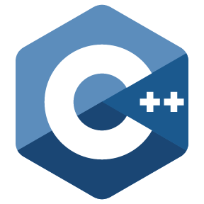

## Добро пожаловать! 

Меня зовут Денис Шахбазян, я backend-разработчик с большой страстью к созданию программного обеспечения. Мое увлечение программированием проявляется не только в написании кода, но и в создании идей и их воплощении в жизнь.

Один из самых захватывающих моментов для меня — это проектирование архитектуры приложения и обеспечение высокого качества кода. Я убежден, что хорошо спроектированное программное обеспечение не только эффективно выполняет свои функции, но и обеспечивает удобство в поддержке и масштабировании.

Кроме того, я постоянно стремлюсь к самосовершенствованию и изучению новых технологий, чтобы быть в курсе последних тенденций в области разработки. 

Давай создавать что-то удивительное вместе!

**Основные технологии:**

<code></code>
<code></code>
<code></code>
<code></code>
<code></code>
<code></code>
<code></code>
<code></code>
<code></code>
<code></code>
<!--
**DenisShahbazyan/DenisShahbazyan** is a ✨ _special_ ✨ repository because its `README.md` (this file) appears on your GitHub profile.

Here are some ideas to get you started:

- 🔭 I’m currently working on ...
- 🌱 I’m currently learning ...
- 👯 I’m looking to collaborate on ...
- 🤔 I’m looking for help with ...
- 💬 Ask me about ...
- 📫 How to reach me: ...
- 😄 Pronouns: ...
- ⚡ Fun fact: ...
-->
